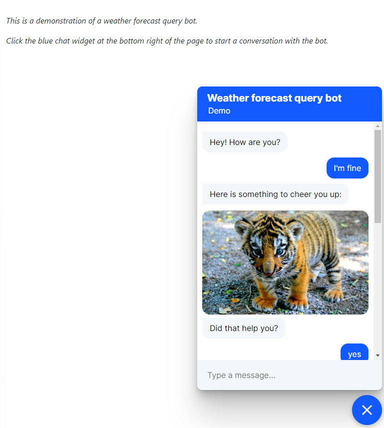

Instruction for start the BOT:
> * Locate in the 09_1 folder and from terminal:
> * rasa run --cors "*"
> * rasa run actions
> * python -m http.server

Then, open the browser and digit: 
> * localhost:8000
> * Click onto the blue icon down right.

